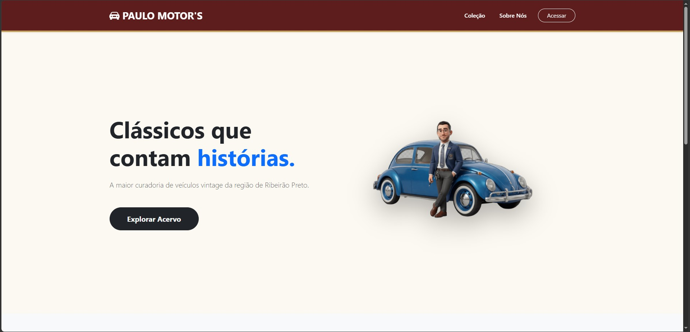
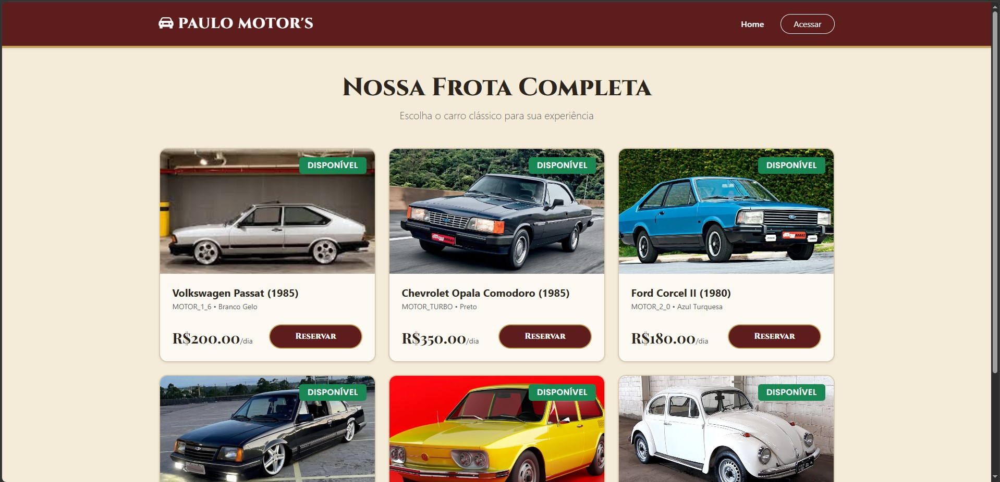
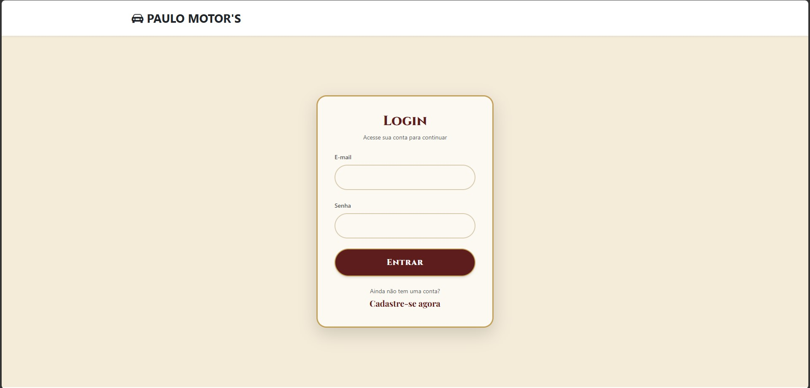
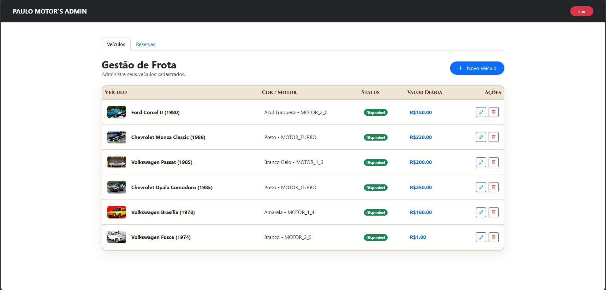
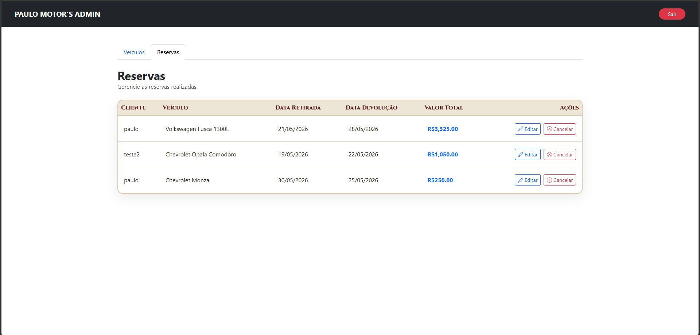

# Paulo Motor's - Sistema de Locação de Veículos Clássicos 🚗✨

O **Paulo Motor's** é uma plataforma desenvolvida para a locação de veículos vintage e clássicos. O sistema oferece uma experiência imersiva para entusiastas de carros antigos, combinando uma interface pública intuitiva de navegação na frota com um painel administrativo completo para controle de estoque, gerenciamento de perfis de acesso e agendamentos de reservas.

---

## 📸 Demonstração do Sistema

### 🏠 Visão Geral e Navegação Pública

#### Home Page
> A maior curadoria de veículos vintage da região de Ribeirão Preto. Uma interface imersiva focada na conversão de novos clientes.


#### Catálogo da Frota
> Exibição em tempo real de carros clássicos disponíveis para locação, com badges dinâmicas de status de disponibilidade.


#### Acesso Seguro (Autenticação)
> Controle de acesso limpo e intuitivo integrado a perfis baseados em regras (Role-Based Access Control).


---

### 📊 Painel Administrativo (Manager Dashboard)

#### Gestão de Frota Ativa
> Listagem gerencial completa exibindo características técnicas detalhadas, valores de diárias e controle de estado do veículo.


#### Controle Geral de Reservas
> Auditoria e monitoramento de datas de retirada, devolução e cálculo automatizado do valor total faturado por locação.


---

## 🛠️ Tecnologias e Arquitetura Frontend

A aplicação foi estruturada utilizando práticas modernas do ecossistema de desenvolvimento web, priorizando performance, forte tipagem, componentização e desacoplamento de código:

* **TypeScript**: Utilização integral da linguagem para garantir tipagem estática forte, interfaces de dados consistentes (Models) e prevenção de erros em tempo de compilação, elevando a confiabilidade do código.
* **Angular 17+ (Stand-alone Components)**: Arquitetura limpa sem a necessidade de declaração modular pesada em `NgModule`.
* **Controle de Estado Reativo (RxJS)**: Gerenciamento eficiente de chamadas assíncronas e concorrência aos endpoints da API do ecossistema backend.
* **Gerenciamento de Formulários Dinâmicos**: Integração bidirecional robusta via `FormsModule` (`[(ngModel)]`) garantindo validação em tempo real e prevenção de payloads corrompidos.
* **Estilização e Responsividade**: Construído sobre o **Bootstrap 5**, garantindo alinhamentos elegantes, tabelas responsivas e modais de alto padrão visual.
* **Estratégia de Geração de Bundle**: Configurações otimizadas para o ciclo de desenvolvimento contínuo (Watch Mode).

---

## ⚙️ Regras de Negócio Implementadas no Front

* **Navegação Condicional baseada em Roles (RBAC)**: Abas de administração da frota (`cars`) ficam restritas visivelmente apenas para usuários autenticados com a permissão `MANAGER`. Clientes comuns têm acesso direto ao histórico de locações pessoais.
* **Tratamento de Ciclos de Vida e Atualização Assíncrona**: Utilização estratégica de `ChangeDetectorRef.detectChanges()` para forçar sincronização de renderizações complexas em modais após requisições HTTP bem-sucedidas.
* **Manipulação Inteligente de Datas**: Conversão e formatação automática de fusos horários ISO (`Z`) em strings curtas padrão para preenchimento nativo de inputs do tipo HTML5 `date`.

---

## 🚀 Como Executar o Ambiente Local

### Pré-requisitos
Certifique-se de possuir instalado em sua máquina o [Node.js](https://nodejs.org/).

### 1. Clonar o Repositório
```bash
git clone [https://github.com/SeuUsuario/paulo-motors-front.git](https://github.com/SeuUsuario/paulo-motors-front.git)
cd paulo-motors-front
2. Instalar as Dependências
Bash
npm install
3. Executar o Servidor de Desenvolvimento
Bash
npm start
Após o build terminar com sucesso, a aplicação estará disponível localmente em http://localhost:4200/.